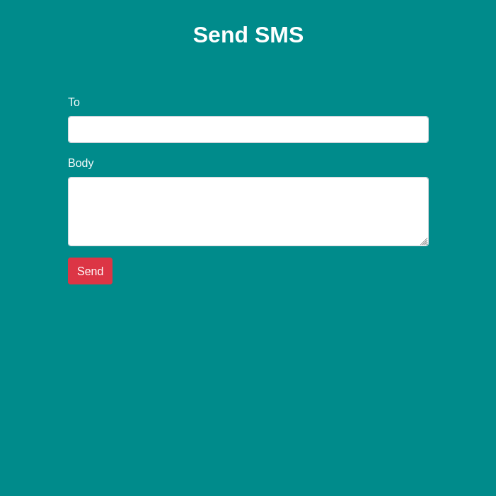

# Use Serverless Functions to Send an SMS with React, Twilio Programmable SMS


To see how to build the project yourself, check out the [blog post](https://www.twilio.com/blog/use-serverless-functions-send-sms-react-vercel-twilio).

This project was bootstrapped with [Create React App](https://github.com/facebook/create-react-app).


## Running the project

To run the project you will need a [Twilio account](www.twilio.com/referral/JbKvV2) and a Twilio phone number that can send SMS messages. Gather your Twilio Account Sid and Auth Token from the [Twilio console](https://www.twilio.com/console) and the phone number.

Clone the project, change into the directory and install the dependencies.

```bash
git clone https://github.com/lelouchB/react-twilio-sms-serverless.git
cd react-twilio-sms-serverless
npm install


Copy the `.env.example` file to `.env` and fill in your Twilio credentials and phone number.

```

Open the app at [localhost:3000](http://localhost:3000). You can now use the form to send SMS messages via your Twilio number.
